# Procesverslag
Markdown is een simpele manier om HTML te schrijven.  
Markdown cheat cheet: [Hulp bij het schrijven van Markdown](https://github.com/adam-p/markdown-here/wiki/Markdown-Cheatsheet).

Nb. De standaardstructuur en de spartaanse opmaak van de README.md zijn helemaal prima. Het gaat om de inhoud van je procesverslag. Besteedt de tijd voor pracht en praal aan je website.

Nb. Door *open* toe te voegen aan een *details* element kun je deze standaard open zetten. Fijn om dat steeds voor de relevante stuk(ken) te doen.

## Jij

  
uitwerken voor kick-off werkgroep

  ### Auteur:
  Syarah Dalfour

  #### Je startniveau:
  Blauw

  #### Je focus:
  surface plane (voor nu)
 

## Je website

  
uitwerken voor kick-off werkgroep

  ### Je opdracht:
  https://eu.waterdrop.com/

  #### Screenshot(s) van de eerste pagina (small screen): 

  Homepage 

  

  

  

  

  #### Screenshot(s) van de tweede pagina (small screen):
  
  Newsletter 

 

 

 

## Toegankelijkheidstest 1/2 (week 1)

  
uitwerken na test in 1e werkgroep

  ### Bevindingen
  Lijst met je bevindingen die in de test naar voren kwamen:

  #### Screenreader
  Hier korte omschrijving (met indien nodig afbeeldingen)

  Hier een omschrijving van hoe het opgelost kan worden (met indien nodig afbeeldingen)

  --> taal veranderd bij stappen
  --> sold out word niet meteen voorgelezen, eerst door alles heen en dan naar de sold out knop
  --> images hebben beschrijving 

  #### Muis en Toetsenbord 
  Hier korte omschrijving (met indien nodig afbeeldingen)

  Hier een omschrijving van hoe het opgelost kan worden (met indien nodig afbeeldingen)

  #### Motoriek (shocks, elastiekjes)
  Hier korte omschrijving (met indien nodig afbeeldingen)

  Hier een omschrijving van hoe het opgelost kan worden (met indien nodig afbeeldingen)

  #### Visueel (brillen, contrast, kleurenblind, dark/light). 
  Hier korte omschrijving (met indien nodig afbeeldingen)

  Hier een omschrijving van hoe het opgelost kan worden (met indien nodig afbeeldingen)
--> rechtyerkant van eht scherm is slecht/niet te zien en het midde is (hemifield loss
--> blur/glare, alles is slecht te lezen en wazig en sommige opties zijn niet te zin omdat de kleur grijs is (kruisjes), website is vrij visueel dus je kan wel raden waar je naar kijkt
--> color, alles is nog goed te zien en te lezenm, de website heeft veel wit dus alles is nog helder en zichtbaar
--> simuspecs, website is nog wel te bedienen, letterltyoe is vrij groot en elementen ook dus alles is nog goed te lezen

## Breakdownschets (week 1)

  
uitwerken na afloop 2e werkgroep

  ### de hele pagina: 
  

  ### dynamisch deel (bijv menu): 
  

  ### wellicht nog een dynamisch deel (bijv filter): 
  

## Voortgang 1 (week 2)

  
uitwerken voor 1e voortgang

  ### Stand van zaken
  hier dit ging goed & dit was lastig (neem ook screenshots op van delen van je website en code)

## Oefening progressie
Deze week heb ik de typografie oefeningen gemaakt en geoefend met flexbox en custom properties

(insert extra uitleg en tegenslagen)

Progress fotos:

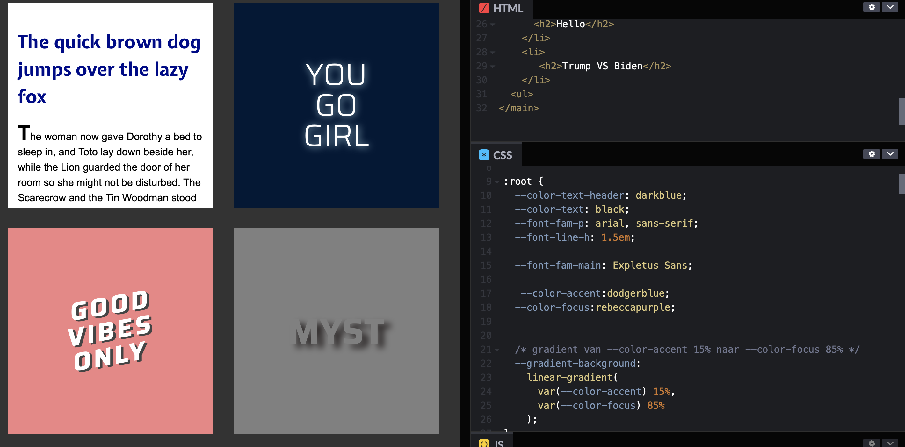
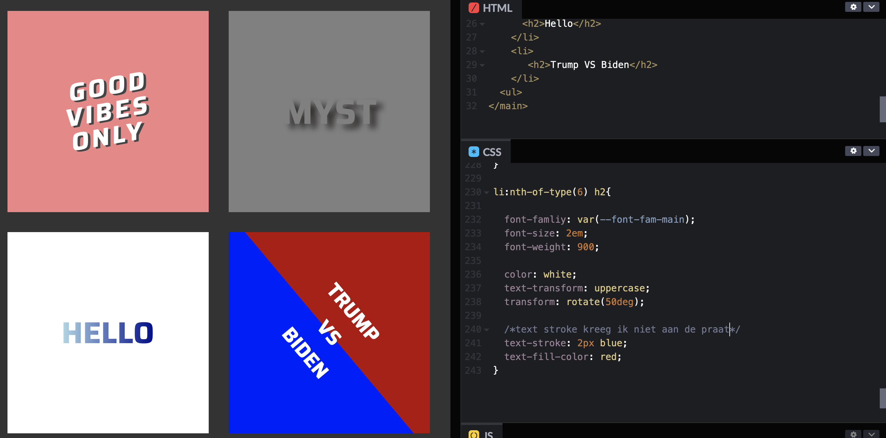
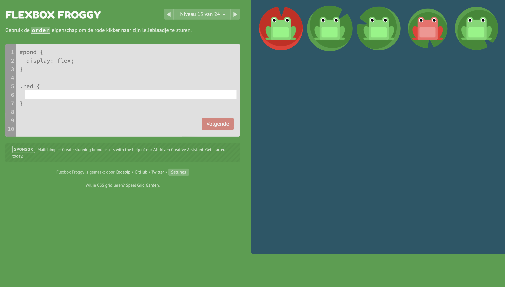

## Website progressie

Voor het eertse voorgtnag gesprek was ik nog niet zeer ver met de website. Ik focuste vooral op de oefeneingen en weer inkomen in het coderen van html en css. Voor de website heb ik de basis html kunnen schrijven van de eerste section van de homepage.

  ### Agenda voor meeting
  samen met je groepje opstellen

  | Nensi          | Lichelle           | Syarah    | Linsey      |
  | ---            | ---            | ---          | ---              |             
  | css selectoren | Breakdownschets| breakdown schets, basic html vragen | afwezig 
  | ...            | ...                | ...          | ...              |         

| cesar     | 
  | ---            | 
  | dit bespreken  | 
  | en dat ook nog | 
  | ...            |

  ### Verslag van meeting
  hier na afloop snel de uitkomsten van de meeting vastleggen

  - aria hidden besproken --> h1 is niet zichtbaar voor de lezer maar wel voor de screenreader
  - breakdown schetsen bespreken en aanpassen
  - 
  - ...

## Voortgang 2 (week 3)

  
uitwerken voor 2e voortgang

  # Stand van zaken
  hier dit ging goed & dit was lastig (neem ook screenshots op van delen van je website en code)

## CSS selectoren
- week 27 sept 
in de les geoefend met css selectoren, begon stroef maar werd er steeds beter in en heb alle opdrachtjes afgerond

- week 3 okt - 6 okt
CSS heb ik nu door en kan ik goed mee overweg in de code voor mn website

#### CSS screenshot:

### Grid
Deze week gewerkt aan grid oefeningen met de grid garden om daar meer mee te kunne oefenen. Grid in de oefening vind ik wel te doen maar grid in mijn wbesite is nog niet gelukt omdat ik nog niet duidelijk weet waar ik grid voor kan gebruiken in mijn website

### Website voortgang

Ook heb ik deze week mijn html voor de eerste pagina afgerond en ben aan de slag gegaan met de css. Voor de 2e voortgang heb ik de css over de helft af kunnen krijgen. 

Tijdens de css styling liep ik tegen een aantal punten aan die en besloot daar vragen over te stellen vij de voortgang.

#### Html screenshots

### Flexbox en postioneren

flexbox was in de les en oefeningen zeer goed te doen alleen lukte het niet om te doen tijdens het css stylen. Na een aantal keer dingen te proberen code stukmaken en door de voorbeelden van sanne heen werd het iets meer helder en heb ik het nu toe kunnen  passen. Het probleem zat vooral dat ik eerst display flex tegen te parent moest zeggen voordat ik met de kinderen kon flexen.

Dit was ook het geval met positioneren. Ik wist de termen maar sprak in de verkeerde volgorde tegen de kinderen en de parents.

# Wat ging goed

Zoals eerder benoemd waren dit onderdelen die goed dingen:

- html schrijven
- css selectoren
- flex box en positioneren

# wat ging niet goed

voorafgaande voortgang liep ik tegen een aantal probelemen aan:

## nav bar verwdijnt
 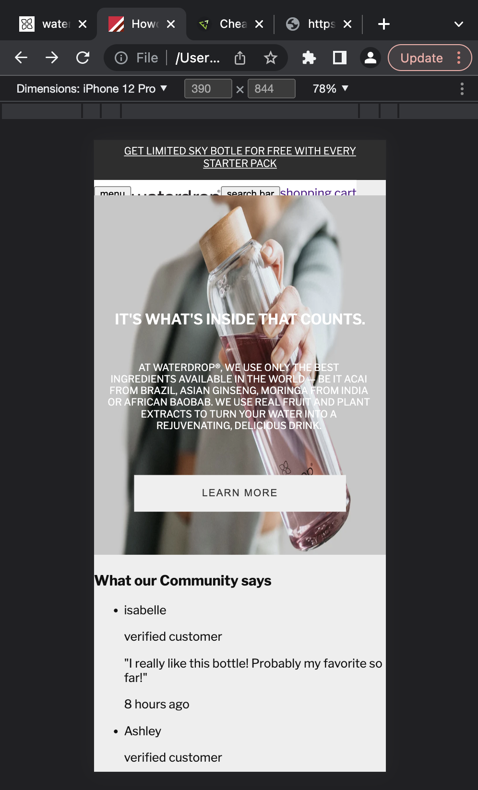
  
## font size h1, h2, h3 etc groter maken
 Als ik het font groter maakte verdween het. Ik kwam er veel later achter dat het niet verdween, Ik scrolde naar boven en zah de h3 in een groter formaat staan. De position die ik eraan gaf zorgte ervoor dat het grotere font niet op dezelfde plek kon staan.

 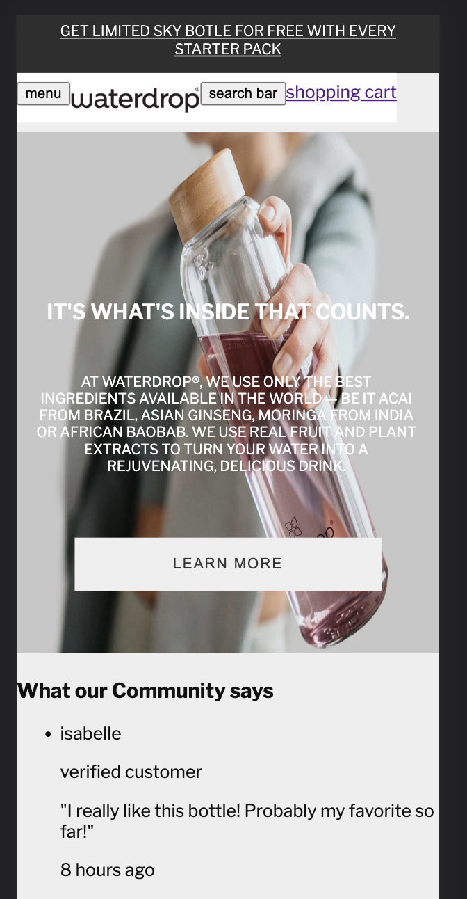
 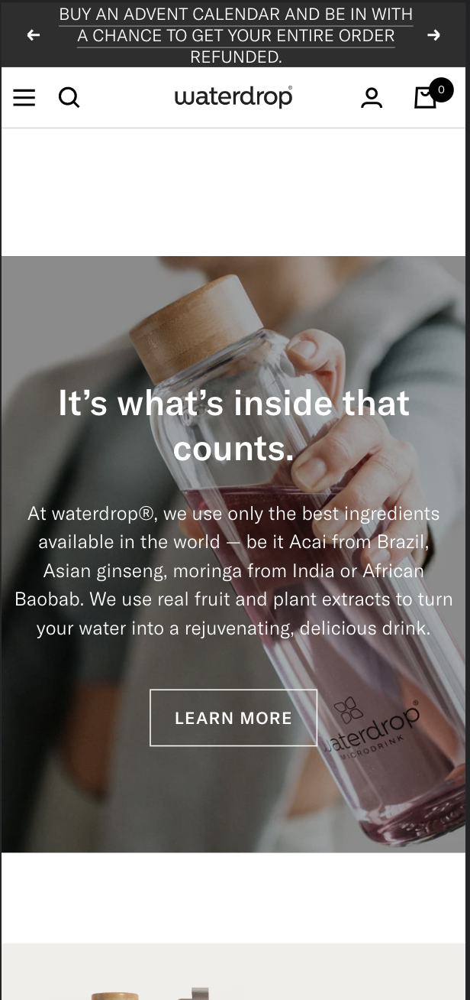

 dit is hoe groot het text formaat moet zijn op de website (ik vond zelf dat het goed overeen kwam) Bron screenshot website:https://eu.waterdrop.com/

## styling p'tjes in de carousels

Ik kreeg de p'tje niet onder elkaar zoals op de website

 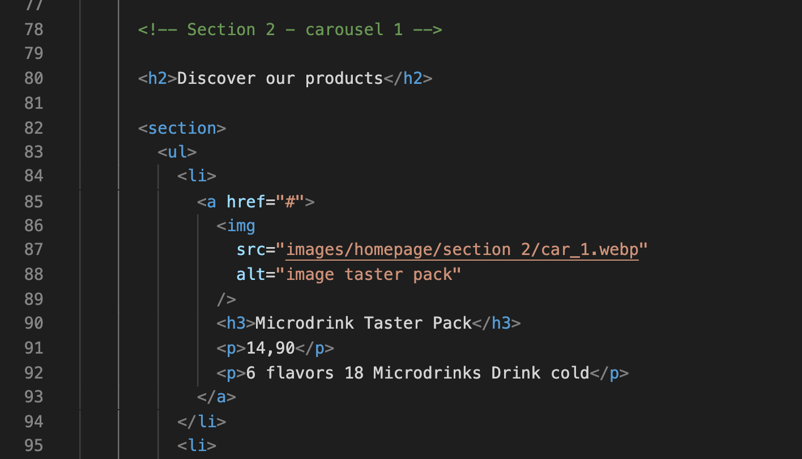

 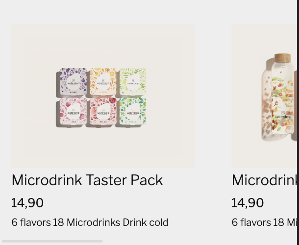

## Nav bar styling

Het tweede deel van de navbar lukte me nog niet om correct te stylen. Hier wil ik zelf eerst meer aandacht aan besteden en zal er op een later moment hulp bij vragen. 

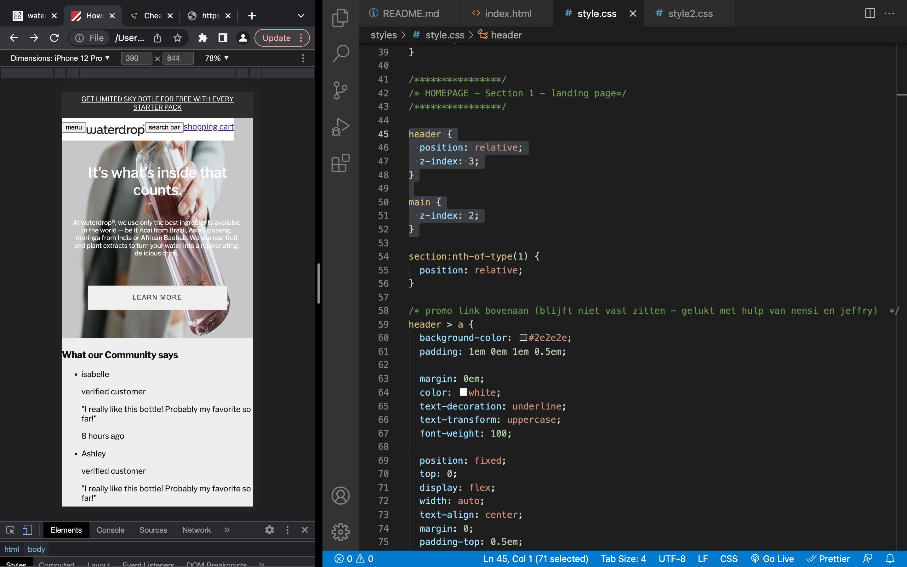

## Promo image scale 
 

## zelf carousels maken
ondanks het oefenen in de lessen lukte het me (na een aantal uur coderen en code stukmaken) niet om de carousel zelf volledig werkend te krijgen dus ik heb gebruik gemaakt van een van de voorbeelden van sanne en eruit gehaald wat ik nodig had om mijn carousels werkend te krijgen

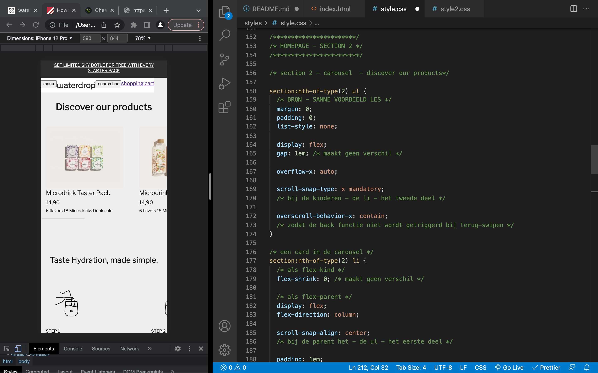

  ### Agenda voor meeting
  samen met je groepje opstellen

  | Syarah      | Nensi          | Lichelle   | cesar        |
  | ---            | ---                | ---          | ---              |
  | Css-styling  | menu styling             | geen vragen    | lettertype    |
  |  |  |  |  |
  | ...            | ...                | ...          | ...              |

| Linsey     | 
  | ---            |
  | geen vragen  | 
  |  | 
  | ...            

  ### Verslag van meeting
  hier na afloop snel de uitkomsten van de meeting vastleggen

  - navbar verdwijnt achter images --> gebruik maken van zindex om herarchie te creeren (probleem opgelost!)

  

  - Font size aanpassen --> jeffrey heeft laten zien hoe het moet. Door het schrijven van een langere css regel word die code meer belangrijk en zal het font wel moeten veranderen. Probleem bij mij ligt waarschijnlijk aan css code die botst met het fontsize en niet genoeg ruimte heeft om groter te worden

  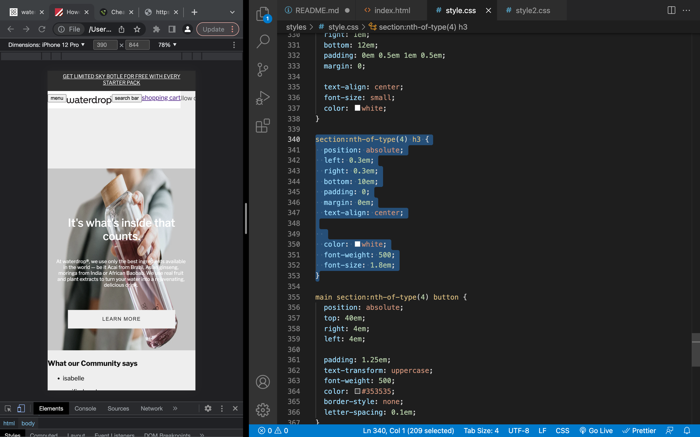
  

  - Styling p --> Jeffrey gaf aan dat er meer manieren voor zijn (makkelijkst is om er een ul + li van temaken) dus ik ga wat uitproberen en kan bij hem terecht mocht het niet lukken

- video styling --> Het video format die ik had gedownload had niet het juiste format voor mobile. Jeffrey liet zien waar ik de source kon vinden en heb nu de landingpage video met mobile size! (ook gaf hij aan ivm privacy rechten dat er een play button bij moet)

- image styling --> 

## Toegankelijkheidstest 2/2 (week 4)

  
uitwerken na test in 8e werkgroep

  ### Bevindingen
  Lijst met je bevindingen die in de test naar voren kwamen (geef ook aan wat er verbeterd is):

  #### Screenreader
  Hier korte omschrijving (met indien nodig afbeeldingen)

  Hier een omschrijving van hoe het opgelost kan worden (met indien nodig afbeeldingen)

  #### Muis en Toetsenbord 
  Hier korte omschrijving (met indien nodig afbeeldingen)

  Hier een omschrijving van hoe het opgelost kan worden (met indien nodig afbeeldingen)

  #### Motoriek (shocks, elastiekjes)
  Hier korte omschrijving (met indien nodig afbeeldingen)

  Hier een omschrijving van hoe het opgelost kan worden (met indien nodig afbeeldingen)

  #### Visueel (brillen, contrast, kleurenblind, dark/light). 
  Hier korte omschrijving (met indien nodig afbeeldingen)

  Hier een omschrijving van hoe het opgelost kan worden (met indien nodig afbeeldingen)

## Voortgang 3 (week 4)

  
uitwerken voor 3e voortgang

  ### Stand van zaken
  hier dit ging goed & dit was lastig (neem ook screenshots op van delen van je website en code)

## home page 

Voor nu is mijn homepage zo goed als af op kleine onderdelen na:
- styling side menu
- icoon styling
- darker filter over promo image

## detail page

Net aan begonnen, nav bar overgenomen en wil voor de volgende les de html af en css basis hebben staan.

## progress

- De oplossingen van jeffrey heb ik gebruik van gemaakt en heb ik werken gekregen in de code. (nav bar styling, buttons nav link zichtbaar, img inplaats van video, carousel styling)

- landing oage --> De website veranderd hun landing page contenu dus om het makkelijker te maken voor mezelf en privacy problemen te voorkomen heb ik een image gebruikt inplaats van video

- De review section --> heb ik met hulp van sanne werkend gekregen. Het heeft een infinite animatie met 3 keyframes en 3 delays. Kan ik uitleggen en uitleg staat in comments

- Javascript --> Javascript kan ik volgen en heb ik werkend gekregen in de code (dropdown en schuifmenu) Kan het uitleggen maar moet soms nog wel spieken voor de juiste structuur

- Plane --> Ik ga voor nu de responsive kant en als er extar tijd over blijft wil ik wat surface plane stukjes toevoegen

## komende week

Zoals eerder vermeld wil ik voor de volgende les de homepage volledig af en detail page zo ver mogelijk zodat ik bij de toegankelijkheids test mijn pagina's goed kan testen en derest van de week besteden aan de benodigde verbeteringen

  ### Agenda voor meeting
  samen met je groepje opstellen

  | Syarah      | Nensi          | Lichelle   | cesar        |
  | ---            | ---                | ---          | ---              |
  | css-styling menu en detail-pagina  | scrollen homepage             | side menu en detail-pagina    | html en dropdown list footer    |
  |  |  |  |  |
  | ...            | ...                | ...          | ...              |

| Linsey     | 
  | ---            |
  | geen vragen  | 
  |  | 
  | ...     

  ### Verslag van meeting
  hier na afloop snel de uitkomsten van de meeting vastleggen

  - punt 1
  - punt 2
  - nog een punt
  - ...

## Eindgesprek (week 5)

  
uitwerken voor eindgesprek

  ### Je uitkomst - karakteristiek screenshots:
  

  ### Dit ging goed/Heb ik geleerd: 
  Korte omschrijving met plaatjes

  

  ### Dit was lastig/Is niet gelukt:
  Korte omschrijving met plaatjes

  

## Bronnenlijst

  
continu bijhouden terwijl je werkt

  Nb. Wees specifiek ('css-tricks' als bron is bijv. niet specifiek genoeg).

  1. Sanne Voorbeelden carousel - https://codepen.io/shooft/pen/BaxVvYG

  2. Video homepage - https://eu.waterdrop.com en https://cdn.shopify.com/videos/c/o/v/be9dcd0bf77643eda49d587dbe908eef.mp4

  3. positioneren --> 

  4. uppercase in text --> https://www.w3schools.com/cssref/pr_text_text-transform.asp

  5. Repsonsive images --> https://www.w3schools.com/howto/howto_css_image_responsive.asp

  6. remove white gap on page --> https://stackoverflow.com/questions/23664510/how-to-remove-white-space-left-and-right-side-of-page

